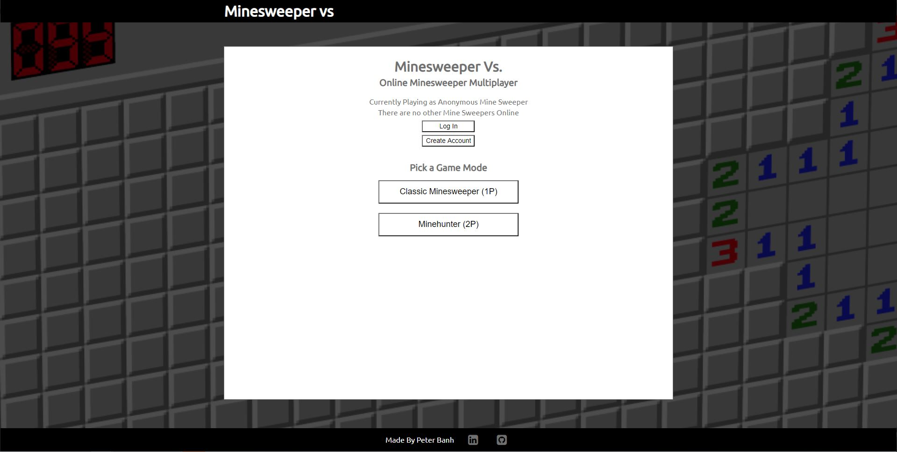
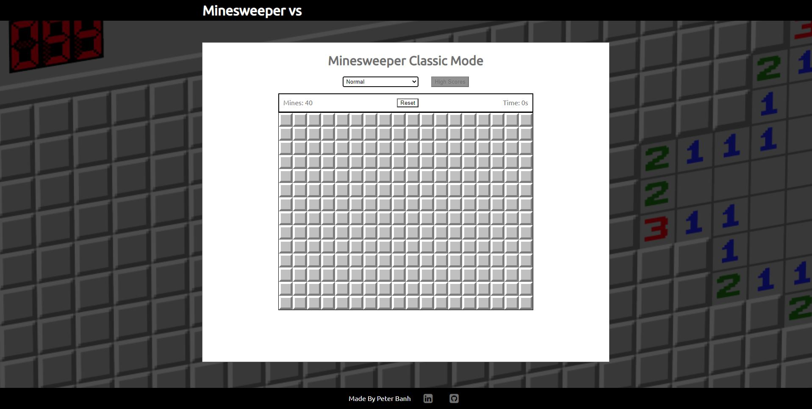

# Minesweeper Vs
Minesweeper Vs is a web application to allow users to play minesweeper on the browser by themselves or with friends. 

Play Minesweeper Vs [here](https://minesweeper-vs.herokuapp.com/).

# Technologies Used
Minesweeper Vs uses:
- PostgreSQL
- Express
- React
- NodeJS
- WebSockets
- Heroku

# Next Steps
Currently, Minesweeper Vs only supports the classic minesweeper mode. The next steps for minesweeper vs is to:
- Add multiplayer game mode Time Race Minesweeper where a user can challenger another user to playing the same minesweeper grid.
- Add the multiplayer game mode Minehunter Galore where 2 users find as many mines as they can, however there are no turns.
- Resolve memory leak in the Minesweeper Data
- Validate user creation with email
- Allow users to use their email to retrieve their username or password
- Develop overall theme for Minesweeper vs

